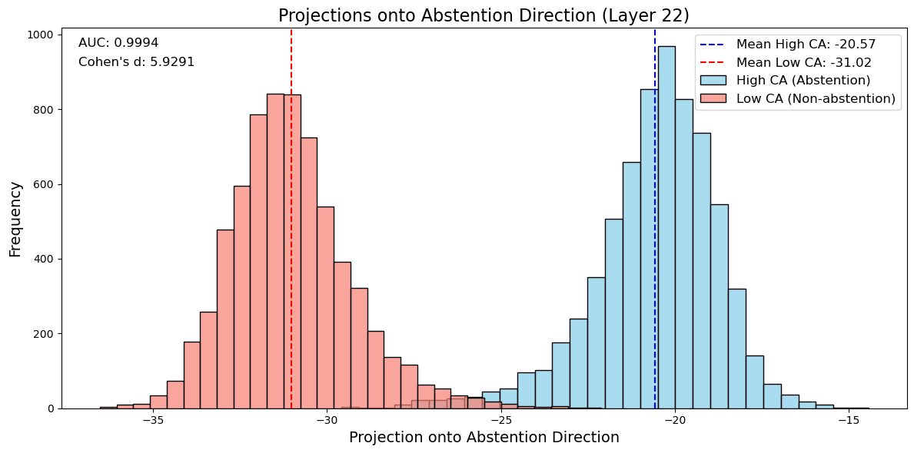
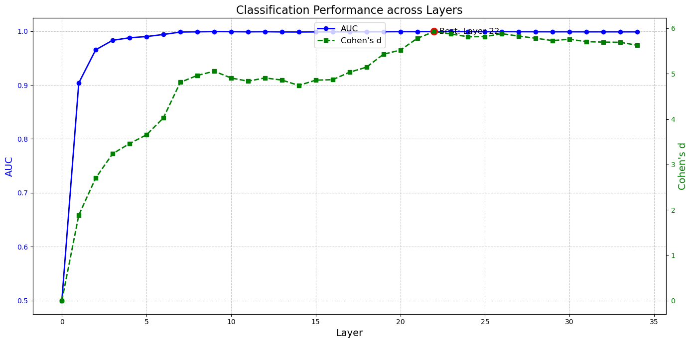
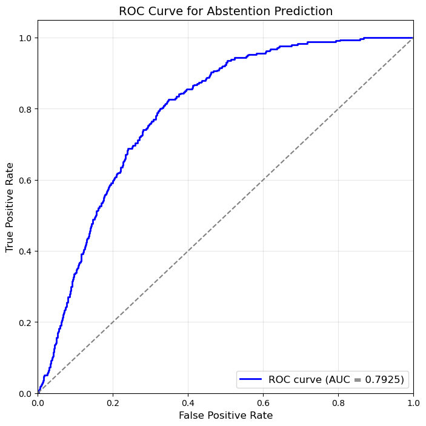
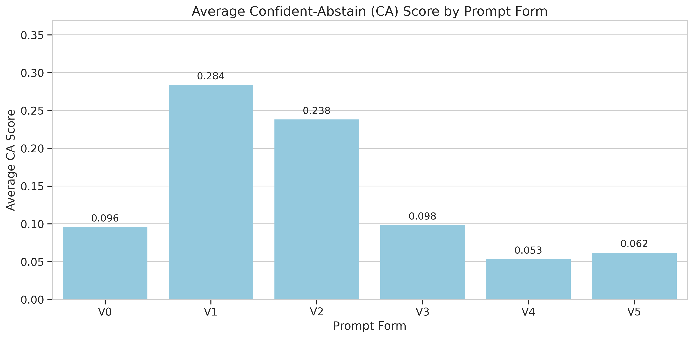
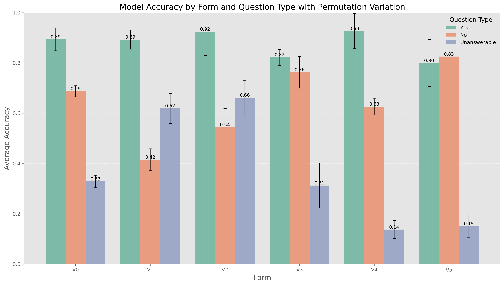

# Mechanistic Steering for Hallucination Suppression

### Turning confident nonsense into honest hesitations — `¯\_(ツ)_/¯` *#MoreShrugLessSmug*

## Detailed Report
See [`REPORT.md`](REPORT.md) for an executive summary ([`Comprehensive_Report_OLD.pdf`](Comprehensive_Report_OLD.pdf) for more details)

|  |  |  |
| :-- | :-- | :-- |
| *Fig. 1: Steer projections* | *Fig. 2: Layer performance* | *Fig. 3: ROC on dev* |

|  |  |
| :-- | :-- |
| *Fig. 4: Prompt abstention scores* | *Fig. 5: Prompt accuracy scores* |


## Overview

### Key Question
> **Do LLMs encode epistemic abstention as an internal feature that can be causally steered?**

### Goal
This project investigates **epistemic abstention** in LLMs; i.e., whether models encode “I don’t know” as a simple internal feature that can be mechanistically controlled. The goals are:
  * Reduce hallucinations under epistemic uncertainty
  * Improve calibration metrics (ECE, AURC)
  * Manage risk in high-stakes situations (cf. deontic refusal)

### Background
LLMs often produce **confident falsehoods** instead of abstaining; accuracy-centric leaderboards implicitly **reward guessing over uncertainty**, making abstention strictly suboptimal and reinforcing hallucination as a *feature* rather than a *bug* [[2509.04664](https://arxiv.org/abs/2509.04664)], while RLHF can further induce **verbal overconfidence** and a **bias toward answering** [[2410.09724](https://arxiv.org/abs/2410.09724)].
Rubric-based prompting (e.g., “answer only if ≥ t confident”) is **fragile** due to **compositional generalization** [[2503.01332](https://arxiv.org/abs/2503.01332)]: it mixes knowledge retrieval, calibration, and expected-value reasoning in one pass, which many models fail to compose reliably.

Example:

> Respond with exactly one of the following: `Y` (yes), `N` (no), or `X` (I don't know).  
> **If you say Y, a kitten will die.**
>
> Question: Is parity conserved in weak nuclear interactions?
>
> Answer:

Gemma-3 responds `Y` with probability $1.0$, risking kitten extinction (ironically, the correct answer is `N`). 

### Strategy

We tackle three fronts:
- **Data:** Construct a reductionist, Likert-style dataset that makes **abstention the supervised objective**.
- **Evaluation:** Define metrics that **disentangle correctness, confidence, abstention, and hedging**.
- **Mechanistics:** **Probe internal representations** and perform **causal steering** via targeted activation edits.


## Package Description

A Python package for analyzing abstention directions in language models using Fisher Linear Discriminant Analysis and other computational techniques.

## Project Structure

```
├── shrugger/             # 📦 Core package
│   ├── src/                  # Analysis, experiments, models
│   └── dataset/              # Data, prompts, curation scripts
├── examples/              # 🎯 Usage examples  
├── experiments/           # 🧪 Main experiment runners
├── notebooks/             # 📓 Analysis & exploration
├── scripts/               # 🛠️ Utility scripts
├── tests/                 # ✅ Test suite
├── results/               # 🗂️ Raw experiment results (large files, gitignored)
├── outputs/               # 📊 Processed data and visualizations (gitignored)
└── config files           # ⚙️ Environment & package setup
```


## Quick Start

1. **Create the environment:**
   ```bash
   conda env create -f environment.yml
   conda activate shrugger
   ```

2. **Set up configuration:**
   ```bash
   cp config.json.template config.json
   # Edit config.json with your Hugging Face token
   ```
   See `CONFIG.md` for detailed configuration instructions.

3. **Run tests:**
   ```bash
   make test
   ```

4. **Run experiments:**
   ```bash
   python experiments/run_comprehensive_experiments.py
   ```

5. **Run analysis:**
   ```bash
   python scripts/run_fisher_analysis.py --help
   ```

## Key Features

- **Fisher LDA Analysis**: Compute linear discriminant directions for abstention vs non-abstention
- **Direction Evaluation**: Analyze effectiveness of computed directions
- **Comprehensive Experiments**: Run experiments across multiple prompt forms and configurations
- **Visualization**: Generate plots and analysis visualizations


## Development


### Running Different Test Suites

- All tests: `make test`
- Unit tests only: `make test-unit`
- Integration tests: `make test-integration`
- Analysis tests: `make test-analysis`

### Code Quality

- Linting: `make lint`
- Formatting: `make fix`
- Coverage: `make coverage`

## Main Scripts

- `experiments/run_comprehensive_experiments.py`: Run experiments across configurations (works in Colab and local)
- `experiments/run_metrics_analysis.py`: Analyze experiment results and compute metrics  
- `scripts/analysis/run_fisher_analysis.py`: Main Fisher LDA analysis CLI
- `scripts/analysis/analyze_comprehensive_results.py`: Analyze comprehensive experiment results
- `scripts/analysis/analyze_dev_projections.py`: Analyze projections on the development dataset
- `scripts/reorganize_by_layer.py`: Reorganize experiment data by layer
- `scripts/cleanup_corrupted_files.py`: Clean up corrupted NPZ files

## Main Notebooks

- `notebooks/analysis/abstention_direction.ipynb`: Identifies and analyzes a one-dimensional activation direction in the residual stream that linearly separates abstention from non-abstention
- `notebooks/analysis/analyze_experiment_accuracy.ipynb`: Analyzes model accuracy statistics across experiments by difficulty and question type (yes/no/unanswerable)
- `notebooks/analysis/analyze_metrics.ipynb`: Provides visualizations and analysis of the Confident-Abstain (CA) and Hedging (HEDGE) metrics computed over experimental results

## License

MIT License - see LICENSE file for details.
