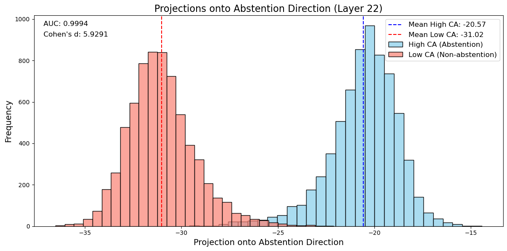

# Mechanistic Steering for Hallucination Suppression

## Summary

- **Approach.** Built a **Likert‑scale dataset** that directly elicits *epistemic abstention* via graded verbal confidence and an explicit **IDK/abstain** option; then ran **layerwise linear analyses** (Fisher LDA with Ledoit–Wolf shrinkage) on **residual‑stream activations at the answer token**.
- **Result.** A **single linear direction** in **mid‑to‑late layers** (peaking near **layer 22** of `gemma-3-4b-it`) **separates abstention vs. non‑abstention**. Near‑perfect on train (**AUC ≈ 0.99**) and strong on dev (**AUC = 0.7925**, **Cohen’s d = 1.21**).
- **Implication.** Enables a viable **causal steering knob** for abstention to **improve calibration** (ECE/AURC) with **minimal accuracy loss** (Fig. 3; see § Toward Causal Steering).

## Motivation

LLMs often produce **confident falsehoods** instead of abstaining. Accuracy‑centric leaderboards implicitly **reward guessing over uncertainty**, making abstention strictly suboptimal and reinforcing hallucination as a *feature* rather than a *bug* [[2509.04664](https://arxiv.org/abs/2509.04664)]. RLHF can further induce **verbal overconfidence** and a **bias toward answering** [[2410.09724](https://arxiv.org/abs/2410.09724)]. Rubric‑based prompting (e.g., “answer only if ≥ t‑confidence”) is **fragile** due to **compositional generalization** [[2503.01332](https://arxiv.org/abs/2503.01332)]: it mixes knowledge retrieval, calibration, and expected‑value reasoning in one pass, which many models fail to compose reliably. We therefore begin by designing a **reductionist probe** where **abstention itself is the downstream task**.

## Hypotheses

1. **Late‑layer 1‑D encoding (confirmed).** Abstention is captured by a **single dominant direction** linearly readable at the answer token in later layers.  
2. **Specificity (supported).** The abstention signal is distinct from generic indecision or safety refusals; **hedging** is rare while **IDK** varies strongly with phrasing.  
3. **Calibration gains via steering (open).** **Activation edits** along the abstention direction will **modulate abstention probability** and improve **ECE/AURC** with limited accuracy impact.

## Dataset & Metrics

### Dataset

LLM-assisted generation and multi-stage curation using the system and user prompts in [abstainer/dataset/prompts](abstainer/dataset/prompts) ($>95\%$ cross-model accuracy).
Factual **Yes/No/Unanswerable** items spanning **14 subjects** and **5 difficulty tiers**, each with a **Likert-style** confidence grade and an explicit **IDK/Unsure** option. This reductionist format minimizes confounds from arithmetic, multi-hop reasoning, and option-elimination strategies, yielding a **clean behavioral signal** of epistemic uncertainty. The Likert scale is verbalized across multiple prompt variants to enhance abstention elicitation and assess robustness. **General structure** (label-token choices and permutations controlled):

* [A] Certainly yes
* [B] Likely yes
* [C] Uncertain
* [D] Likely no
* [E] Certainly no

### Metrics

Let the model’s probability for abstention be $p_U=p_C$. Define

$$
p_{\text{yes}} = p_A + p_B,\quad p_{\text{no}} = p_D + p_E,\quad q=\max(p_{\text{yes}},  p_{\text{no}})
$$

- **Confident‑Abstain (CA):**

$$
\mathrm{CA}(p)=\frac{p_U}{ p_U+q }.
$$

High when **IDK** dominates either Yes/No side.

- **HEDGE (hedging without abstaining):** let $s=1-p_U$ and the conditional Yes/No distribution

$$
r=\Big[\tfrac{p_{\text{yes}}}{s},\ \tfrac{p_{\text{no}}}{s}\Big],\quad H(r)=-\sum_i r_i\log r_i.
$$

Then

$$
\mathrm{HEDGE}(p)=s\cdot \frac{H(r)}{\log 2}\in[0,1].
$$

High **HEDGE** indicates indecision between Yes/No **while avoiding IDK**.

### Empirics

**Hedging is rare**, while **CA** is highly **prompt‑sensitive**; variants **V1/V2** (see [prompts.py](/abstainer/src/prompts.py)) elicit the clearest abstention signal and are used for mechanistic analysis.

## Methods

1. **Activation extraction.** Residual‑stream vectors $h^{(L)}$ at the **answer token** for all layers $L$.  
2. **Grouping.** Split train data into **top vs. bottom CA quartiles**, balanced by subject and label.  
3. **Direction learning.** **Fisher LDA** with **Ledoit–Wolf** shrinkage to estimate an **abstention direction** $d^{(L)}$ per layer.  
4. **Validation.** Check on dev data for generalization across **held‑out questions**.  
5. **Selection.** Choose layer $L^*$ by **held‑out AUC** (peaks near **layer 22**). See **Fig. 1–2** (train) and **Fig. 3–4** (dev).

## Results

- **Late‑layer linear feature.** Abstention is a **1‑D direction** concentrated in **mid‑to‑late layers**, peaking at **layer 22** (Fig. 2).  
- **Train performance.** **Near‑perfect separability** at layer 22 (**AUC = 0.9994**, **Cohen’s d = 5.93**); **bimodal** projections (Fig. 1).  
- **Generalization.** On dev, **AUC = 0.7925** with **Cohen’s d = 1.21**; group means at **−20.74** vs **−25.93** along $d^{(22)}$ (Figs. 3–4).

## Figures

**Figure 1 — Train projections onto the abstention direction (layer 22).** Distributions of answer‑token activations projected onto $d^{(22)}$ for **high‑CA (abstain)** vs **low‑CA (non‑abstain)** are **cleanly bimodal**; **AUC = 0.9994**, **Cohen’s d = 5.93**.  

**Figure 2 — Layerwise discrimination performance.** **AUC** (left axis) and **Cohen’s d** (right axis) vs layer. Very early layers are near chance; **discrimination rises sharply and peaks near layer 22**, indicating late‑stage linear accessibility of abstention.  

**Figure 3 — Dev ROC at layer 22.** ROC curve for predicting abstention using $d^{(22)}$ achieves **AUC = 0.7925** on the dev set, confirming **transfer across prompts/subjects**.  

**Figure 4 — Dev projections onto the abstention direction (layer 22).** **Clear separation** between high‑CA and low‑CA groups, with means at **−20.74** vs **−25.93**; **Cohen’s d = 1.21**.  

## Toward Causal Steering

With the **unit vector** $d_{L^*}$ at the answer token identified, apply **token‑local edits**

$$
h_L' \longrightarrow h_L + \alpha d_{L^*},
$$

and measure how movement along this **abstention direction** modulates **IDK probability** and **calibration** (ECE/AURC), while monitoring **accuracy** and **risk–coverage**. If successful, this provides a **compact, mechanistic control** for hallucination suppression.
